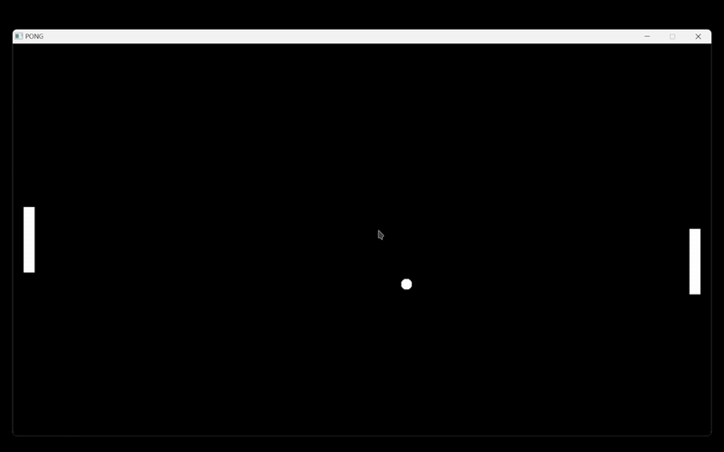

# cpp-projects

Ce repository regroupe mes différents projets réalisés en **C++** pour me familiariser avec le langage.

## 🚀 Projets inclus

### 🏓 Pong
Un remake du célèbre **Pong**, développé pour explorer la **programmation orientée objet (POO)** et la gestion des entrées/sorties avec **SDL2**.

- **Langage** : C++
- **Librairie graphique** : SDL2
- **Concepts abordés** : Programmation orientée objet (POO), gestion des entrées clavier, affichage simple en 2D.

#### 🎮 Aperçu :

---

### 🌌 Raytracing/Raycasting
Un projet d'expérimentation sur le **raytracing/raycasting**, utilisé pour comprendre les bases du rendu graphique et de la gestion des rayons en **C++**.

- **Langage** : C++
- **Librairie graphique** : SDL2
- **Concepts abordés** : Calculs de trajectoires, gestion des collisions visuelles, rendu simple basé sur des rayons.

#### 🎮 Aperçu :

## 📜 À venir
- 🎾 **Casse-briques** : Un projet en cours de développement.
